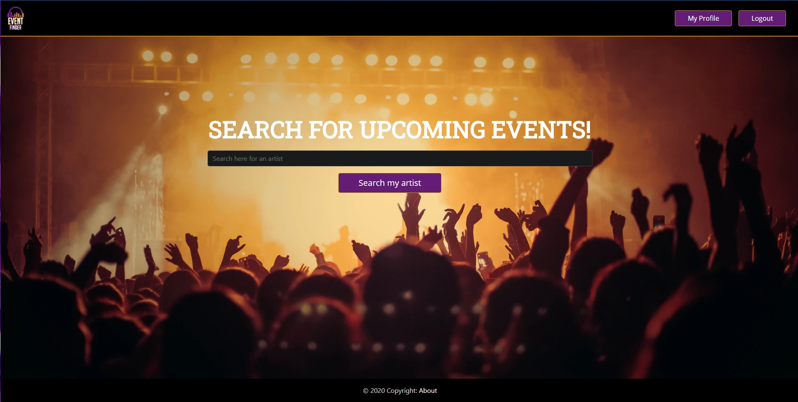

# EventFinder

A project we built in a small scrum team. You can look for your favorite artist(s) and see if they have any upcoming concerts. If you're logged in, you can also see if there are any more tickets available. There's also the possibility of adding artists to your favorites to make it more convenient for you to check their upcoming concerts.

#### Homepage

#### Artist page while logged in

#### Favorites

#### Artist page logged out

#### Login screen using Firebase

This project was built using:

Angular 8
Bootstrap
JSON-server
Firebase (User Auth)
